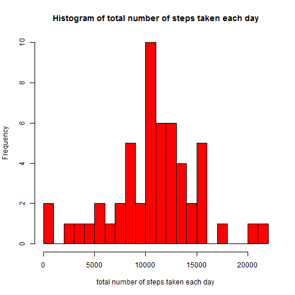
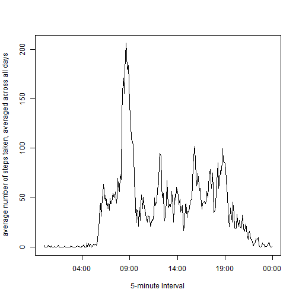
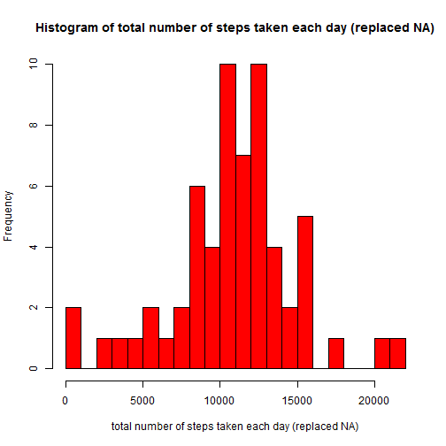
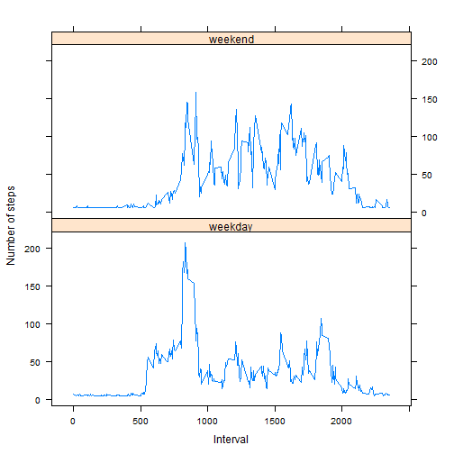

# Reproducible Research: Peer Assessment 1


## Loading and preprocessing the data


1.Load the data (i.e.  read.csv() )


```r
activityDF <- read.csv("..\\repdata_data_activity\\activity.csv", header=TRUE)
```

2.Process/transform the data (if necessary) into a format suitable for your analysis


```r
## Convert date field from Character to a Date field
activityDF$date <- as.Date(activityDF$date,format="%Y-%m-%d")
## Add a dayName field containing the thre letter day (ie. Mon, Tue, etc.)
activityDF <- cbind(activityDF, dayName = format(activityDF$date,"%a") )
## Add IntervalTime as interval converted to Time. Using only Hour and minutes
## formatC converts intervals such as "5" to "0005" to conform to "%H%M"
activityDF$intervalTime <- strptime( formatC(activityDF$interval, width=4, flag="0000"), format="%H%M")

## activityNoNADF will be used for the initial graphing
activityNoNADF <- na.omit(activityDF)
```

## What is mean total number of steps taken per day?

For this part of the assignment, you can ignore the missing values in the dataset.

1.Make a histogram of the total number of steps taken each day


```r
stepsSumByDayDF <- aggregate(x=activityNoNADF$steps, by=list(date=activityNoNADF$date), FUN="sum")

## Using breaks=20 to break histogram out into 1000 step increments
hist(stepsSumByDayDF$x, breaks=20, col="red", xlab="total number of steps taken each day", 
     main="Histogram of total number of steps taken each day")
```

 

2.Calculate and report the mean and median total number of steps taken per day


```r
stepsMean <- mean(stepsSumByDayDF$x, na.rm=TRUE)
stepsMedian <- median(stepsSumByDayDF$x, na.rm=TRUE)

stepsMean
```

```
## [1] 10766
```

```r
stepsMedian
```

```
## [1] 10765
```

The mean total number of steps taken each day is 10766.19  
The median total number of steps taken each day is 10765


## What is the average daily activity pattern?


1.Make a time series plot (i.e.  type = "l" ) of the 5-minute interval (x-axis) and the average number of steps taken, averaged across all days (y-axis)


```r
## Note aggregate( by does not like posixLt, we temporarily convert to char using strftime for aggregation
stepsAvgByIntervalTimeDF <- aggregate(x=activityNoNADF$steps, by=list(intervalTime=strftime(activityNoNADF$intervalTime)), FUN="mean")
                                      
## convert intervalTime back to posixLt from char using strptime
plot( strptime(stepsAvgByIntervalTimeDF$intervalTime, format="%Y-%m-%d %H:%M:%S"), stepsAvgByIntervalTimeDF$x, type="l", xlab="5-minute Interval", 
     ylab="average number of steps taken, averaged across all days")
```

 

2.Which 5-minute interval, on average across all the days in the dataset, contains the maximum number of steps?


```r
intervalTimeMaxAvgSteps <- strftime( stepsAvgByIntervalTimeDF[stepsAvgByIntervalTimeDF$x==max(stepsAvgByIntervalTimeDF$x),"intervalTime"], format="%H:%M")

intervalTimeMaxAvgSteps
```

```
## [1] "08:35"
```

The 5-minute interval, on average across all the days in the dataset which contains the maximum number of steps is 08:35.  

## Imputing missing values

Note that there are a number of days/intervals where there are missing values (coded as  NA ). The presence of missing days may introduce bias into some calculations or summaries of the data.

1.Calculate and report the total number of missing values in the dataset (i.e. the total number of rows with  NA s)


```r
countNA <- sum(is.na(activityDF$steps))

countNA
```

```
## [1] 2304
```

The number of rows with NA values is 2304.  

2.Devise a strategy for filling in all of the missing values in the dataset. The strategy does not need to be sophisticated. For example, you could use the mean/median for that day, or the mean for that 5-minute interval, etc.
 
 The strategy I chose was to compile the mean number of interval steps for each day name. This provides an interval mean for each day name, so all NAs cab be imputed.
 

```r
## Work out the interval mean for each day name (ie. Mon, Tue, etc.)
stepsMeanByDayNameDF <- aggregate(x=activityNoNADF$steps, by=list(dayName=activityNoNADF$dayName), FUN="mean")
```

3.Create a new dataset that is equal to the original dataset but with the missing data filled in.


```r
activityReplaceNADF <- activityDF
## Replace NA values with interval mean for the corresponding day name
for (i in stepsMeanByDayNameDF$dayName)
   activityReplaceNADF[is.na(activityReplaceNADF$steps) & activityReplaceNADF$dayName == i, "steps"] <- 
    stepsMeanByDayNameDF[stepsMeanByDayNameDF[,"dayName"]==i,"x"]
```

4.Make a histogram of the total number of steps taken each day and Calculate and report the mean and median total number of steps taken per day. Do these values differ from the estimates from the first part of the assignment? What is the impact of imputing missing data on the estimates of the total daily number of steps?


```r
stepsSumByDayReplaceNADF <- aggregate(x=activityReplaceNADF$steps, by=list(date=activityReplaceNADF$date), FUN="sum")

hist(stepsSumByDayReplaceNADF$x, breaks=20, col="red", xlab="total number of steps taken each day (replaced NA)", 
     main="Histogram of total number of steps taken each day (replaced NA)")
```

 

```r
stepsMeanReplaceNA <- mean(stepsSumByDayReplaceNADF$x)
stepsMedianReplaceNA <- median(stepsSumByDayReplaceNADF$x)

stepsMeanReplaceNA
```

```
## [1] 10821
```

```r
stepsMedianReplaceNA
```

```
## [1] 11015
```

With imputation, the mean total number of steps taken each day has increased from 10766.19 to 10821.21  

With imputation, the median total number of steps taken each day has increased from 10765
 to 11015

By filling in NAs, I have increased the overall number of steps. This is apparent from comparing the histograms and seeing the change in mean and median. This is not a great strategy.

## Are there differences in activity patterns between weekdays and weekends?

For this part the  weekdays()  function may be of some help here. Use the dataset with the filled-in missing values for this part.

1.Create a new factor variable in the dataset with two levels -- "weekday" and "weekend" indicating whether a given date is a weekday or weekend day.


```r
activityReplaceNADF[, "weekDayEnd"] <- factor(c("weekend","weekday"))
activityReplaceNADF[activityReplaceNADF$dayName == "Sat" | activityReplaceNADF$dayName == "Sun", "weekDayEnd"] <- "weekend"
activityReplaceNADF[activityReplaceNADF$dayName != "Sat" & activityReplaceNADF$dayName != "Sun", "weekDayEnd"] <- "weekday"
```

2.Make a panel plot containing a time series plot (i.e.  type = "l" ) of the 5-minute interval (x-axis) and the average number of steps taken, averaged across all weekday days or weekend days (y-axis). The plot should look something like the following, which was creating using simulated data:


```r
stepsMeanByIntervalTimeWeekDayEndReplaceNADF <- cbind(aggregate(
    x=activityReplaceNADF[activityReplaceNADF[,"weekDayEnd"] == "weekday", "steps"], 
    by=list(intervalTime=strftime( activityReplaceNADF[activityReplaceNADF[,"weekDayEnd"] == "weekday", "intervalTime"])), FUN="mean"),
    weekDayEnd = "weekday")

stepsMeanByIntervalTimeWeekDayEndReplaceNADF <- rbind(stepsMeanByIntervalTimeWeekDayEndReplaceNADF, cbind(aggregate(
    x=activityReplaceNADF[activityReplaceNADF[,"weekDayEnd"] == "weekend", "steps"], 
    by=list(intervalTime=strftime( activityReplaceNADF[activityReplaceNADF[,"weekDayEnd"] == "weekend", "intervalTime"])), FUN="mean"),
    weekDayEnd = "weekend"))
                                                  
library(lattice)

f <- factor(stepsMeanByIntervalTimeWeekDayEndReplaceNADF$weekDayEnd)

xyplot( stepsMeanByIntervalTimeWeekDayEndReplaceNADF$x ~ as.numeric( strftime( strptime( stepsMeanByIntervalTimeWeekDayEndReplaceNADF$intervalTime, format="%Y-%m-%d %H:%M:%S" ), format="%H%M")) | f, layout=c(1,2), type="l", xlab="Interval", ylab="Number of steps" )
```

 
 
 Weekday interval steps have a higher peak than weekend. It is apparent from the plot that more steps are taken at weekends.
